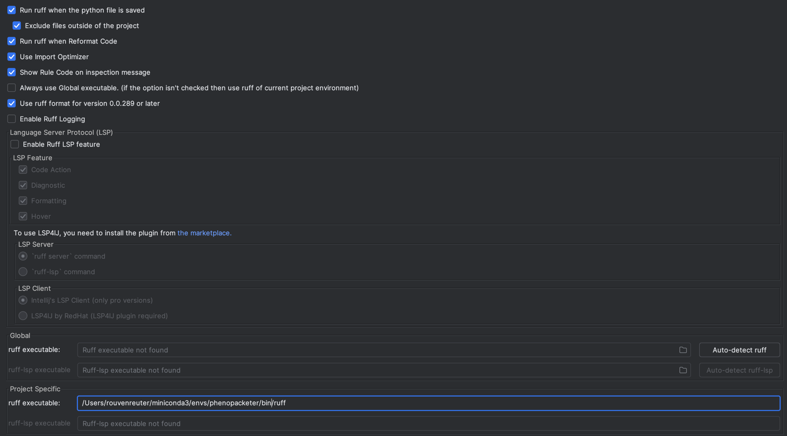
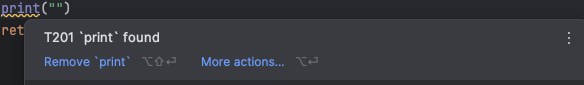
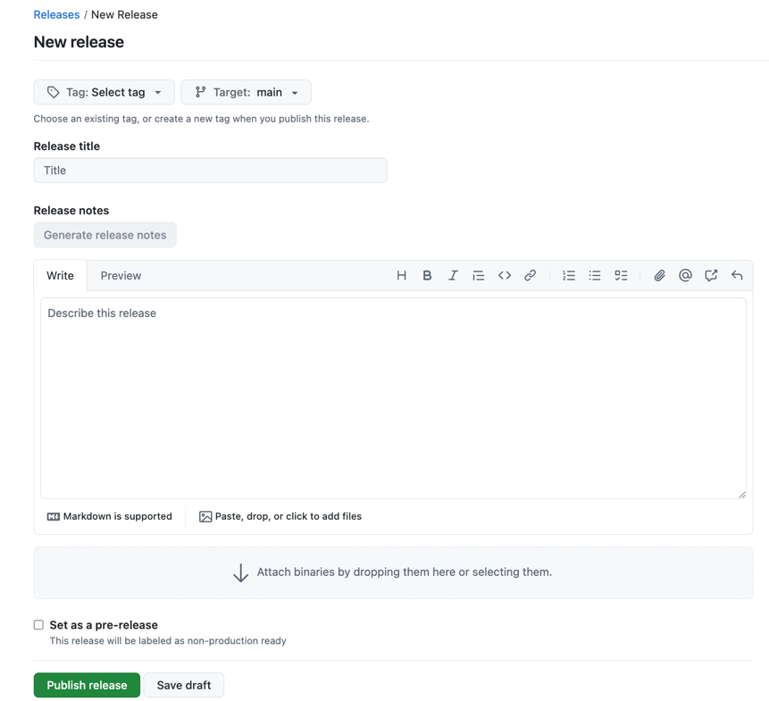

## How to use this template
To the top right-hand side of this repository, you will find a button labeled $${\color{green}Use \space this \space Template}$$. Press it and then click on ``Create a new repository``. This will copy the contents of the repository to your account.
## Robinson Group Python Template
This repo serves as a template for python projects in the [Robinson Group](https://robinsongroup.github.io/) of the BIH.
To get started copy or fork this project and follow the steps below.
## Install conda
If you not already have conda, miniconda or Anaconda installed. Check out the [miniconda installation guide](https://www.anaconda.com/docs/getting-started/miniconda/install#quickstart-install-instructions).

### Setup env
Open `requirements/environment.yml` and adjust `<Project-Name>`.

To create and activate the env execute:

```
conda env create -f requirements/environment.yml
conda activate <Project-Name>
```

## Basic Setup
As this is a template project, some of the directories and setting have generic names. To ensure the project is set up, that it aligns with your intended name please:

1. Rename the folder inside of src
2. Open the pyproject.toml
   - Rename all variables in the sections ``[project]`` and ``[project.urls]``
3. Depending on your needs, you should change the LICENSE of this repository. Default is MIT.

## Ruff Linting and Formatting
Ruff helps to maintain the same code style and prevent the most common bugs in our code base. Keeping the code style uniform simplifies the collaboration - it is much easier to review a pull request without hundreds of whitespace changes.

Please take a moment to learn how to use the IDE plugins. In PyCharm, the formatting action can be invoked with right-clicking at any code location and the same applies for VS Code. The keyboard shortcuts are also available. However, it is recommended to format and lint on saving a file.

Besides the IDE, Ruff can also be run as a command line tool. Assuming that the virtual environment is active, the following command will format/lint the entire project:

**Formatting**
```bash
ruff format
```
**Linting**
```bash
ruff check
```
We recommend to run commit the resulting changes before opening a PR, because the unformatted code will fail the Continuous Integration (CI) pipeline. A PR cannot be merged until the code passes the CI.

### Ruff Plugins
This section will explain how to set up ruff for your choosen IDE.
#### Pycharm
To get ruff automatically running install the following Plugin:
- [Pycharm - Ruff Plugin](https://plugins.jetbrains.com/plugin/20574-ruff)

To use the plugin, make sure that PyCharm has the environment assigned that contains the ruff installation.

##### **Configs:**



You can find out if ruff works by violating one of the rules. Should you do so, you will see a yellow squirrelly line. An easy way to violate one of the rules is to put a 
``print`` statement somewhere.

Then you will see something like this:



#### VSCode
To get ruff automatically running install the following Plugin:
- [VSCode - Ruff Plugin](https://marketplace.visualstudio.com/items?itemName=charliermarsh.ruff)


## Testing

A test suite of a typical Python package consists of unit, integration, and documentation tests
(i.e. the code snippets embedded in the documentation).
It is important to write tests to ensure that your code works as intended.

This template provides a minimal setup for testing. Tests can be executed by invoking Pytest:

```shell
pytest
```

The runner looks for tests in `src` and `tests` folders. On top of that, the Python code
in the top-level `README.md` file is also executed.
If `README.md` shows a snippet like this:

```python
>>> from project_name.foo import foo
>>> foo()
True

```

Pytest will execute the snippet to ensure that invoking `foo()` in fact returns `True`.

The snippets in `README.md` can document the typical use cases of the package.
Since the snippets are executed, any code changes that render the documentation obsolete will be picked up, forcing a documentation update.


## Continuous Delivery
You've done it, your package is at a state, where you want other to use it. Luckily, this repository features a CD-Pipeline,
that will build and upload your packages to Pypi for you. To get the CD running you need to first follow these [instructions](https://docs.pypi.org/trusted-publishers/adding-a-publisher/). The pipeline uses [OIDC](https://openid.net/developers/how-connect-works/) to authenticate on Pypi. Make sure your [pyproject.toml](pyproject.toml) is set up correctly, which means take care of 2. of the section **Basic Setup**.

Then open your repository page on Github. To the right you should find **Create new Release**. Press it!

You will find this page:


Create a new Tag for your release, add a title and a description. If you are still unsure what to do check out the [github release how-to](https://docs.github.com/en/repositories/releasing-projects-on-github/managing-releases-in-a-repository#creating-a-release). Press **Publish release**, watch the CD launch in the **Actions Tab** and enjoy your well deserved coffee. ☕
